# 🦸 Heroes App

Aplicación web construida con React, TypeScript y Vite para explorar héroes y villanos, visualizar estadísticas de poder, guardar favoritos y navegar dinámicamente entre personajes.

---

# 🚀 Características

- 🔍 Búsqueda avanzada de héroes
- ❤️ Sistema de favoritos
- 🧭 Navegación contextual entre páginas
- ⚡ Navegación entre héroes (anterior / siguiente)
- 🖼️ Skeleton loading para imágenes
- 📱 Diseño responsive
- 🌑 Interfaz dark mode moderna
- 📊 Visualización de estadísticas de poder
- 🧠 Tipado completo con TypeScript

---

# 🛠️ Tecnologías utilizadas

- React
- TypeScript
- Vite
- React Router
- TailwindCSS
- shadcn/ui
- Lucide React

---

# 📂 Estructura del proyecto

```bash
src/
├── App.css
├── App.tsx
├── assets/
├── context/
│   ├── HeroesContext.tsx
│   └── HeroesProvider.tsx
├── features/
│   └── heroes/
│       ├── actions/
│       │   └── get-superheroes-by-api.ts
│       ├── api/
│       │   └── akababSuperhero.api.ts
│       ├── components/
│       │   ├── HeroCard.tsx
│       │   ├── HeroesDisplaySection.tsx
│       │   ├── HeroesEmptyState.tsx
│       │   ├── HeroesGrid.tsx
│       │   ├── HeroPaginationController.tsx
│       │   ├── HeroStatBar.tsx
│       │   ├── HeroStatCard.tsx
│       │   ├── HeroStats.tsx
│       │   └── SearchHeroSection.tsx
│       ├── hooks/
│       │   ├── useFavorite.tsx
│       │   ├── useHeroes.tsx
│       │   ├── useHeroesStats.tsx
│       │   └── usePagination.tsx
│       ├── interfaces/
│       │   ├── akababSuperhero.response.ts
│       │   ├── heroLocationState.interface.ts
│       │   ├── heroNavigationFrom.type.ts
│       │   └── superhero.interface.ts
│       ├── layout/
│       │   └── HeroLayout.tsx
│       └── pages/
│           ├── favorites/
│           │   └── FavoritesPage.tsx
│           ├── hero/
│           │   └── HeroPage.tsx
│           ├── home/
│           │   └── HomePage.tsx
│           └── search/
│               └── SearchPage.tsx
├── index.css
├── main.tsx
├── router/
│   └── HeroAppRouter.tsx
└── shared/
    ├── components/
    │   ├── custom/
    │   │   ├── CustomHeader.tsx
    │   │   ├── Footer.tsx
    │   │   ├── Hero.tsx
    │   │   ├── MenuBar.tsx
    │   │   ├── MobileMenu.tsx
    │   │   ├── SearchBar.tsx
    │   │   └── SearchFilters.tsx
    │   └── ui/
    │       ├── badge.tsx
    │       ├── button-group.tsx
    │       ├── button.tsx
    │       ├── card.tsx
    │       ├── field.tsx
    │       ├── input.tsx
    │       ├── label.tsx
    │       ├── native-select.tsx
    │       ├── navigation-menu.tsx
    │       ├── pagination.tsx
    │       ├── separator.tsx
    │       ├── sheet.tsx
    │       └── spinner.tsx
    └── lib/
        └── utils.ts
```

---

# ⚙️ Instalación

Clona el repositorio:

```bash
git clone <https://github.com/mvalenciar/SuperHero_App.git>
```

Instala las dependencias:

```bash
npm install
```

Inicia el entorno de desarrollo:

```bash
npm run dev
```

---

# 🧭 Rutas principales

| Ruta              | Descripción       |
| ----------------- | ----------------- |
| `/`               | Página principal  |
| `/favorites`      | Héroes favoritos  |
| `/advancedSearch` | Búsqueda avanzada |
| `/hero/:idSlug`   | Detalle del héroe |

---

# ✨ Funcionalidades destacadas

## Navegación contextual

La aplicación recuerda desde qué página se abrió un héroe utilizando `location.state`, permitiendo regresar correctamente a:

- Home
- Favoritos
- Búsqueda avanzada

---

## Navegación entre héroes

Desde la página de detalle es posible desplazarse al héroe anterior o siguiente sin volver al listado principal.

---

## Carga optimizada de imágenes

Las imágenes utilizan:

- Lazy loading
- Skeleton loading
- Fade transition

para mejorar la experiencia de usuario.

---

# 📸 Preview

### 🖥️ Desktop

> Vista principal del sistema en pantallas grandes

<p align="center">
  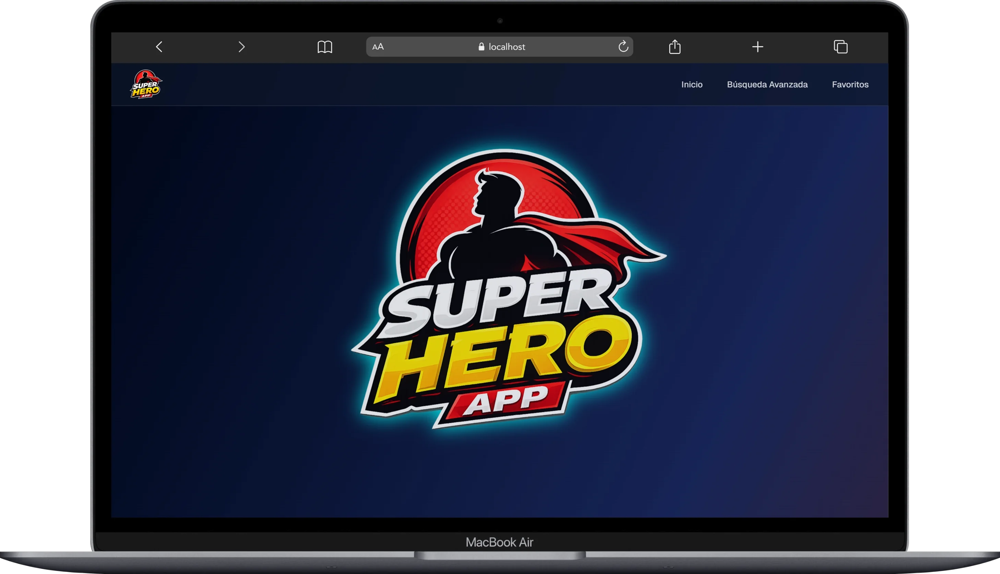
</p>

<div style="display: grid; grid-template-columns: repeat(2, 1fr); gap: 12px;">
<p align="center">
  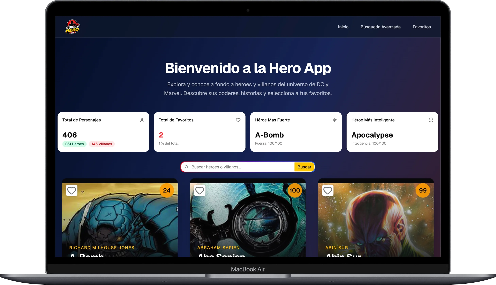
</p>
<p align="center">
  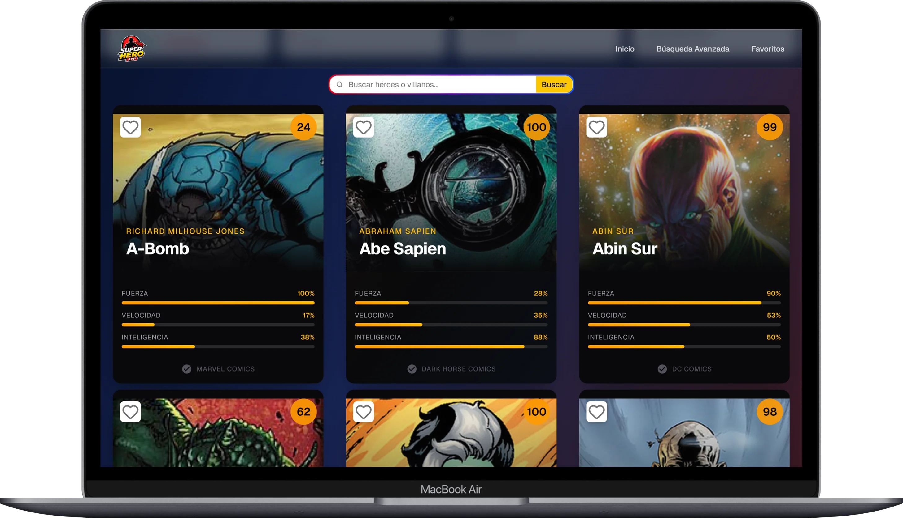
</p>
<p align="center">
  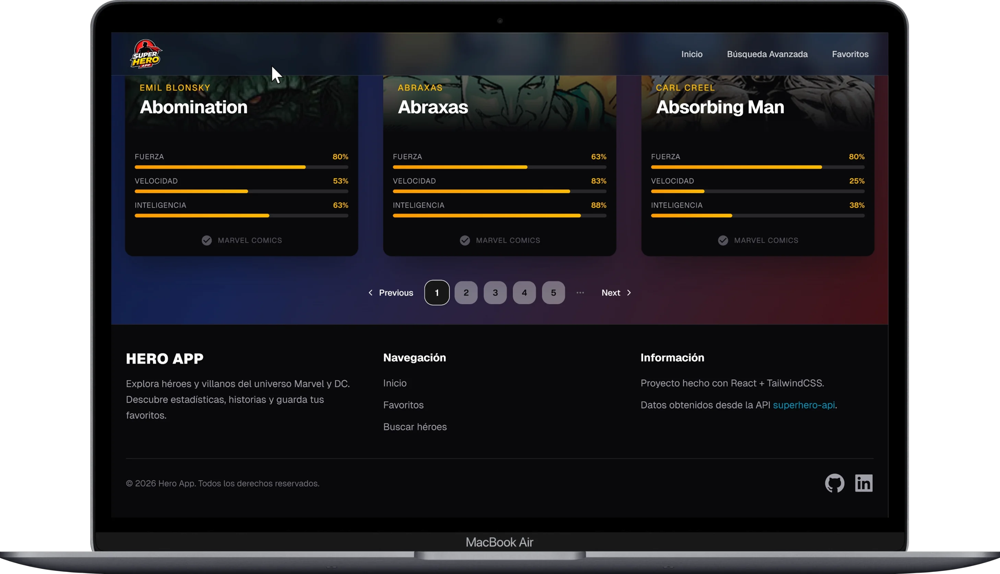
</p>
<p align="center">
  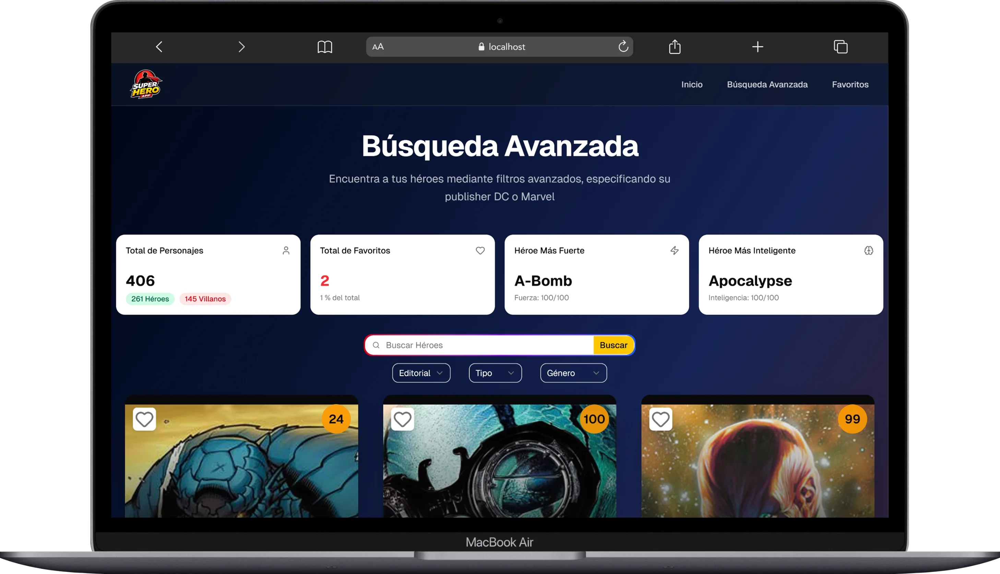
</p>
<p align="center">
  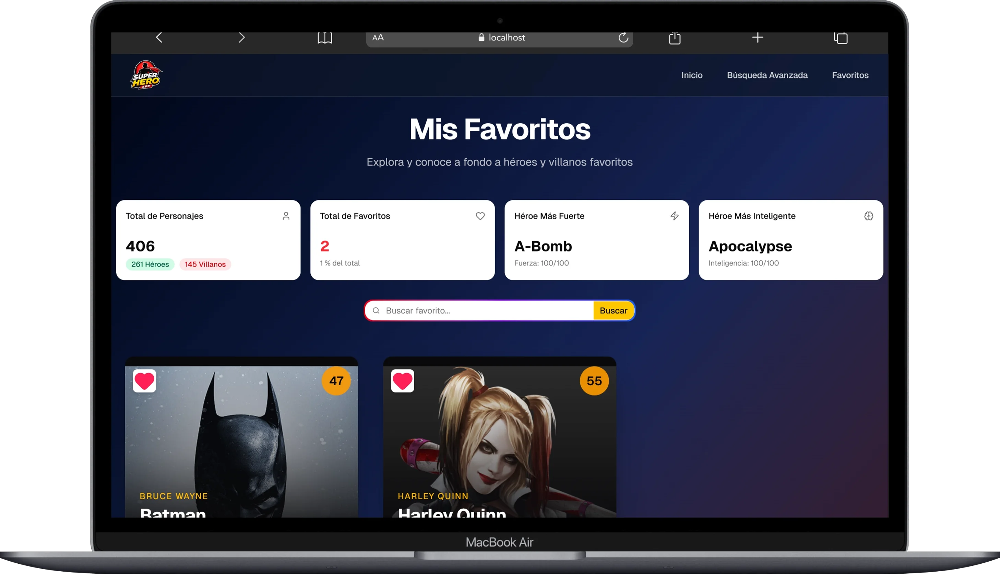
</p>
<p align="center">
  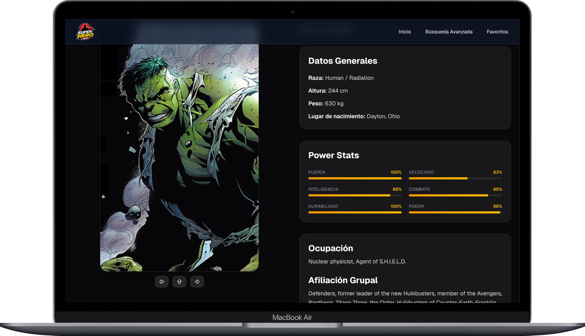
</p>
</div>
### 📱 Mobile

> Adaptación responsive para dispositivos móviles

<div style="display: grid; grid-template-columns: repeat(2, 1fr); gap: 12px;">
<p align="center">
  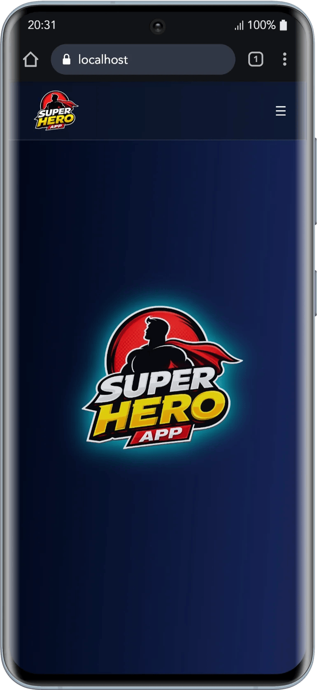
</p>
<p align="center">
  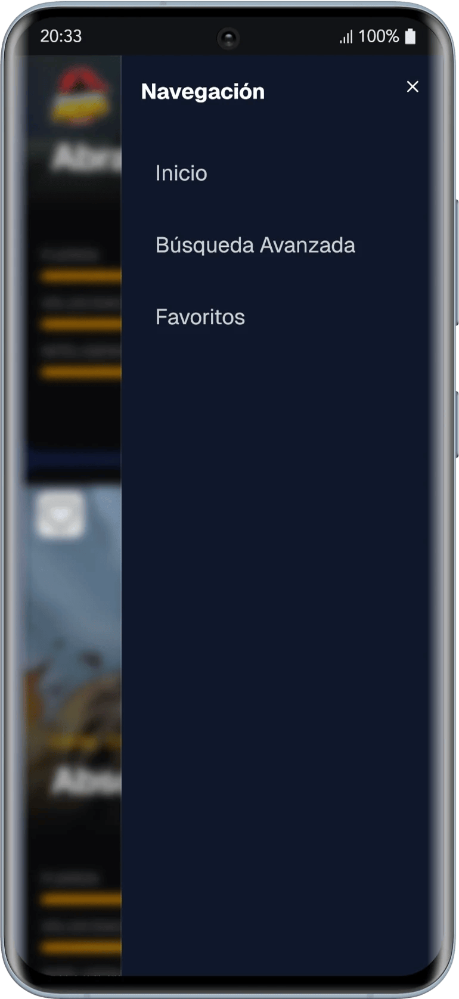
</p>
<p align="center">
  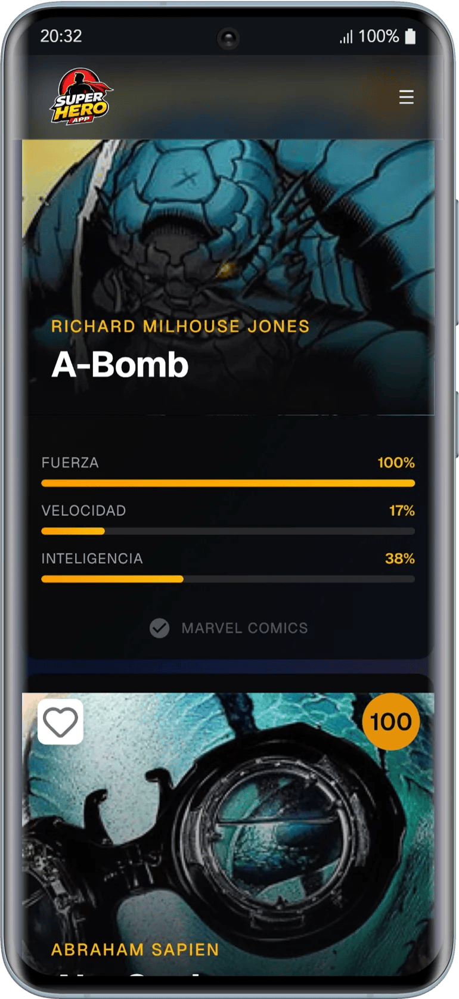
</p>
<p align="center">
  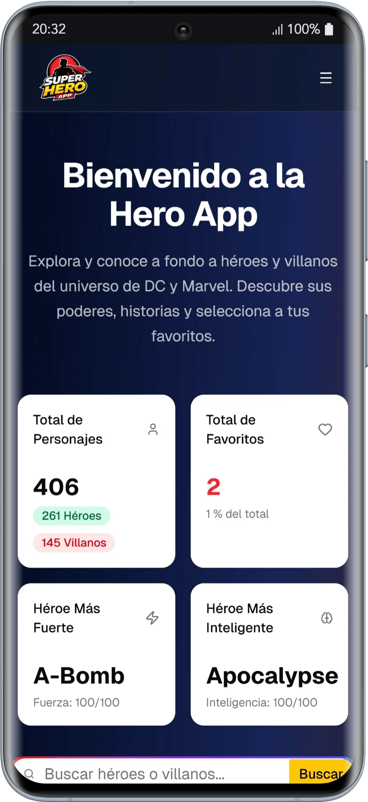
</p>
  <p align="center">
  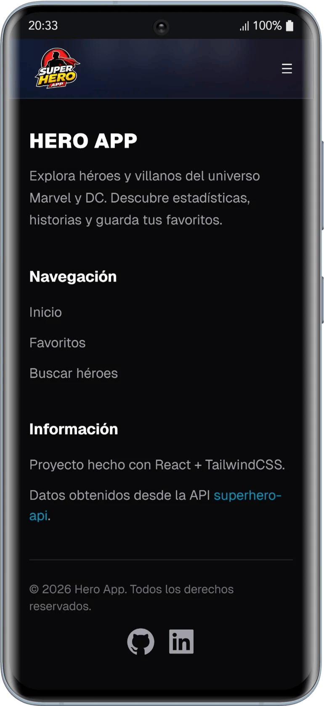
</p>
<p align="center">
  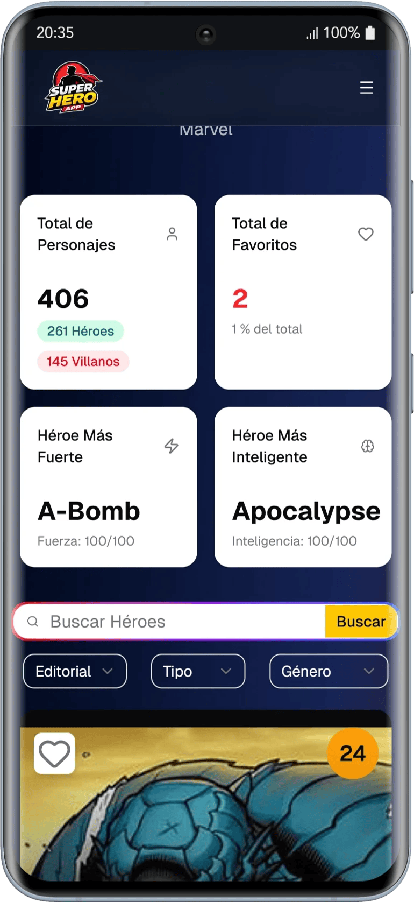
</p>
</div>

---

# 📄 Licencia

Este proyecto es únicamente educativo y de práctica.
